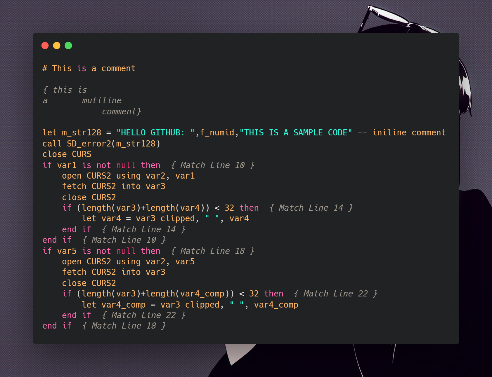

# Moussed's Informix 4gl Formatter

An informix 4gl formatter made in TypeScript that correct indentation with some extra features

> Checkout the extention for vscode [**here**](https://github.com/Di-KaZ/vscode-4gl-formatter/)
## Preview :

### Before


Ugly isnt it ? 🤔

### Line flag enabled


_neaaaaat_

### Condition flag enabled


ℹ I find the condition flag particuly handy has it permmit to just select the commented part and easily find the matching part and the block contained in it.
Combined with an tab highlighter (like indent rainbow),
everything looks Far more readable

### Number flag enabled


⚠ number mode is not really acurate atm. I work on a better implementation

## Usage

|                      Flag                      |        long ver         | Optional ? |   Default   |           Description           |
| :--------------------------------------------: | :---------------------: | :-------: | :---------: | :-----------------------------: |
|                   -f \|\| -d                   | --file \|\| --directory |    ❌     | no default  |     (filepath) or (dirpath)     |
|                       -i                       |        --indent         |     ✔     |    '\\t'    |  string to use as indentation   |
|                       -o                       |        --output         |     ✔     | current dir | directory where to output files |
| -m (none \|\| condition \|\| number \|\| line) |         --mode          |     ✔     |    line     |     Identation mode to use      |

# Modes

- **none** display nothing
- **condition** display the first 40 char of the opening statement on the mathching intermediate & end statement
- **number** display the inner depth of the opening statement on the mathching intermediate && end statement
- **line** display line of the opening statement on the mathching intermediate && end statement

# [Download it ! 😎](https://github.com/Di-KaZ/informix-4gl-formatter/releases)

# If you want compile from source

```bash
yarn install && yarn build-exe
```

It is not perfect but it get the job done 😁

## Plan for future

- Add simple drag & drop graphical interface
- adapt it to a vscode formatter extention
- more edge case management
- more verbose error management

**I hope it will help you in your journey, Enjoy !**
