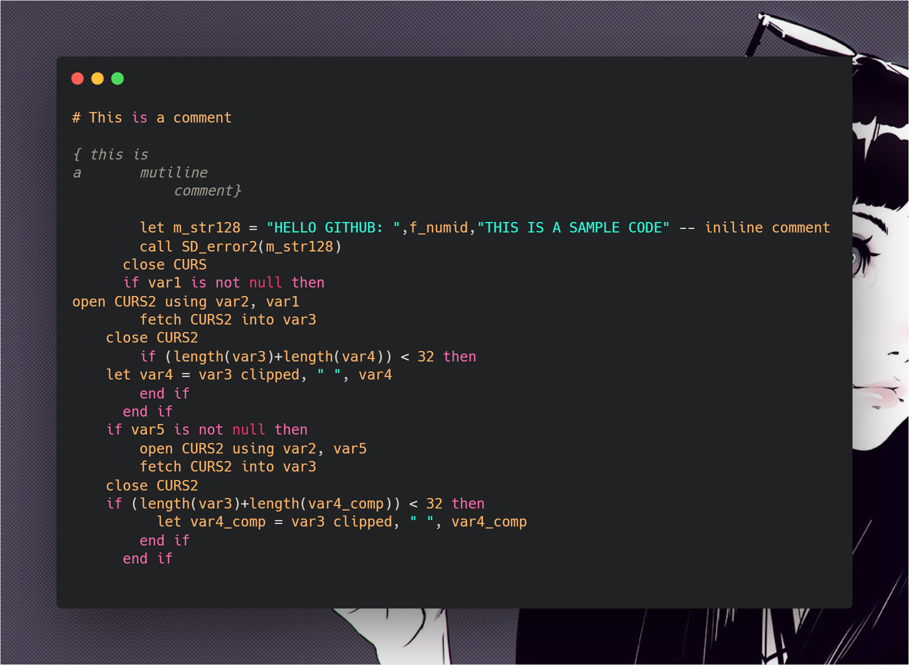
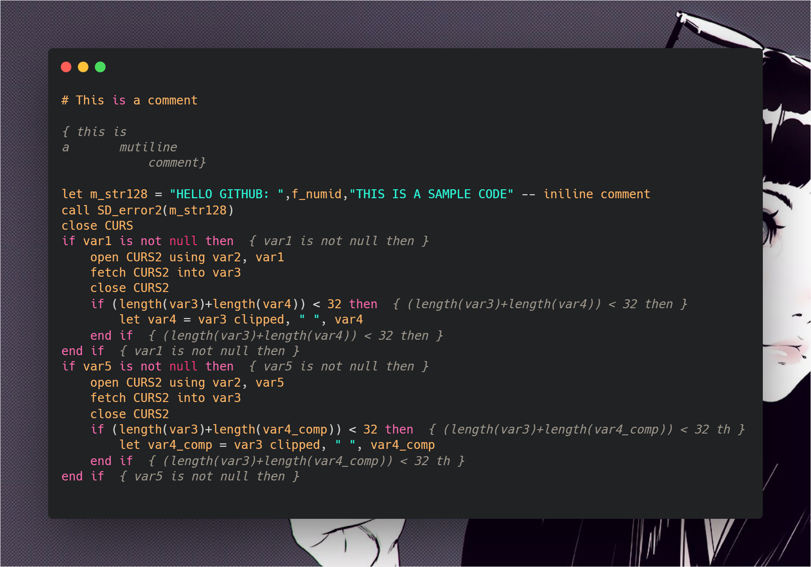
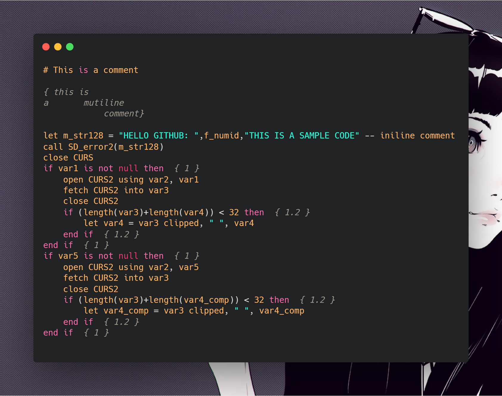

# Moussed's Informix 4gl Formatter

An informix 4gl formatter (indentation) with some extra feature

## Preview :


|Before|condition flag enabled|number flag enabled|
|:-:|:-:|:-:|
||||

I find the condition flag particuly handy has it permmit to just select the commented part and easily find the matching part and the block contained in it.
## Usage

|Flag|Optinal ?| Default| Description|
|:-:|:-:|:-:|:-:|
|-f \|\| -d | no | no default | (filepath) or  (dirpath)|
|-i| yes |'\\t' | string to use as indentation|
|-o| yes |current dir| directory where to output files
|-l (none \|\| condition \|\| number)| yes |condition | Identation mode to use |

# Modes
- **none** display nothing
- **condition** display the first 40 char of the opening statement on the mathching intermediate & end statement
- **number** display the inner depth of the opening statement on the mathchingintermediate && end statement

# [Download it ! 😎](#)


# If you want compile from source

```bash
yarn install && yarn build-exe
```

It is not perfect but it get the job done 😁

## Plan for future
- Add simple drag & drop graphical interface
- adapt it to a vscode formatter extention
- more edge case management
- more verbose error management

#**I hope it will help you in your journey, Enjoy !**